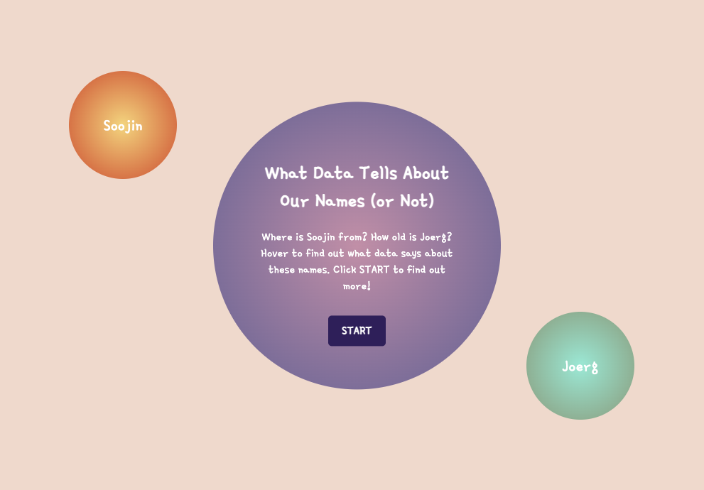
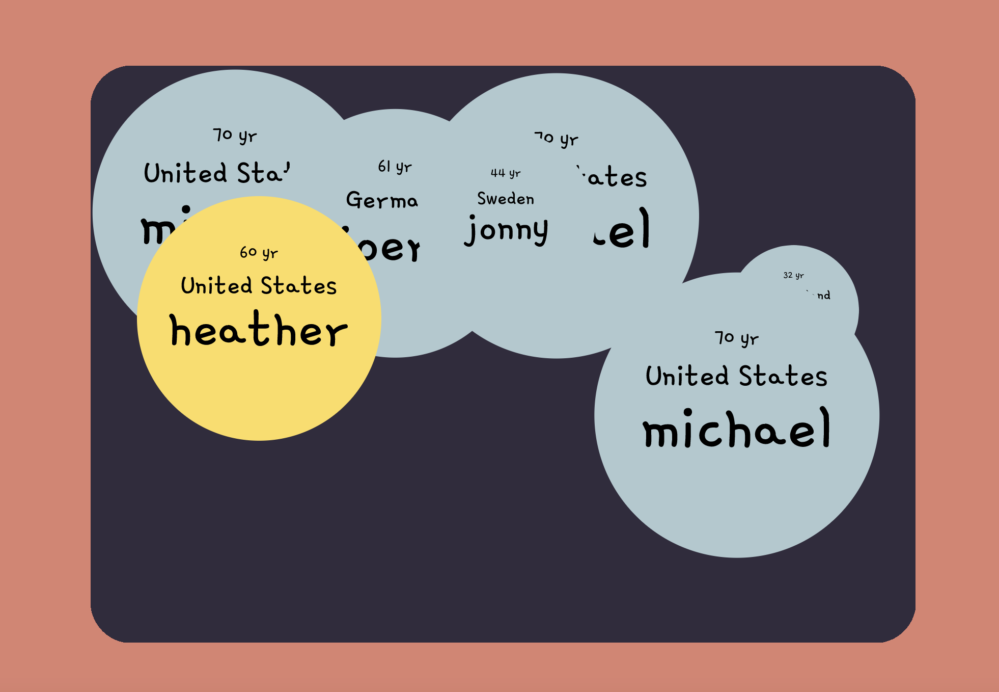
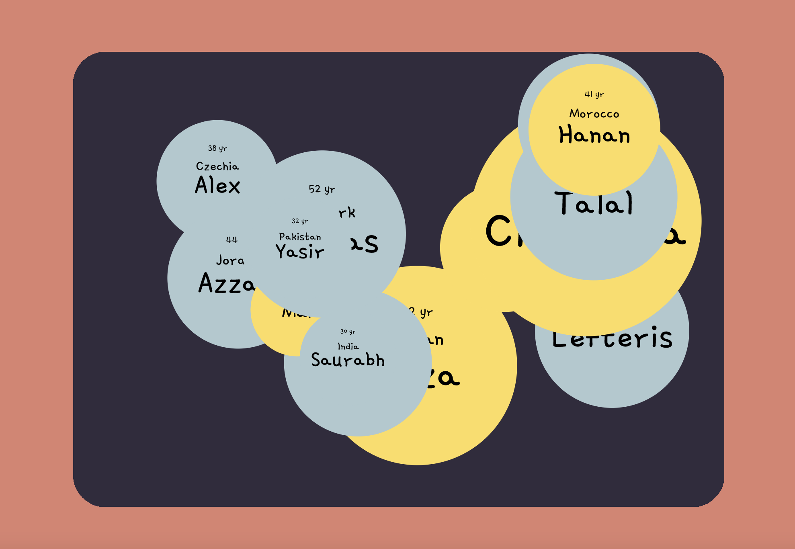
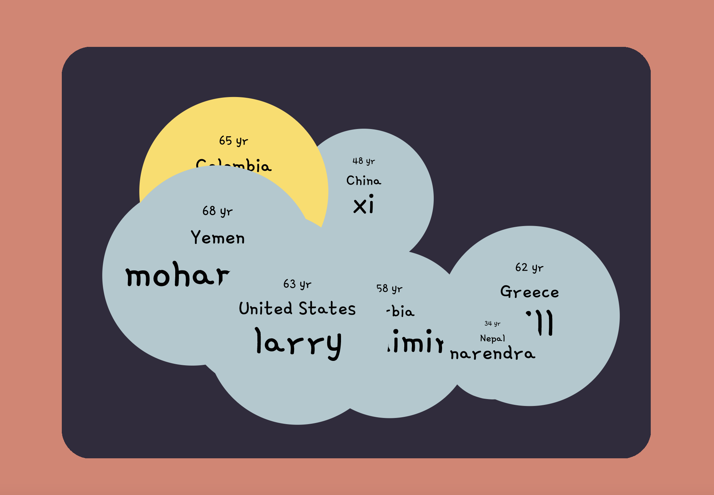

# Politics of Code Final

**Title**: AI    
**Author**: Soojin   
**Category**: Final Project   
**Date**: 20 Apr - 2 May 2022   
**Deliverable**: 1. CSS/HTML/Javascript/API Data Visualization 2. Experiment & Critical Analysis  

## Project Brief

Using three APIs that predict the age, the nationality, and the gender of the given name, I developed a web-based data visualization model that visualizes the data associated with names. This project explores the world demographic through the lens of data, such as the 10 most powerful people, or the Interactive Media Faculty of NYUAD. While exploring the different groups of people and their names, we critically examine the AI biases in names and its potential impact.   

[Access Project Here](https://soojin-lee0819.github.io/PoliticsOfCodeFinal)

## Context

AI Machines are increasingly being used to make all kinds of important decisions including who can open a bank account, what kind of health insurance coverage, or the job screenings. AI has many positive benefits, like freeing up our time to do more chllenging tasks or automating our work. However, despite the repeated claim that data-driven approaches are more objective than the past methods, AI machines don't seem to liberate us from thousands of years of human bias. Most of the AI programs use machine learning, which require data training. It is true that once the machine learning is trainned, the work can be done autonomously without much human intervention, but it is important to notice that AI machines are essentially trainned with human data and are programmed by huamn. This is why AI systems continue to project existing human biases, and further exacerbate those biases at a much faster rate. 

This is why we hear about AI bias mishaps such as  [Google’s facial recognition algorithm labeled black people as gorillas 
](https://www.forbes.com/powerful-people/list/) or more recent [mishap with Amazon’s resume recommendation system] (https://www.reuters.com/article/us-amazon-com-jobs-automation-insight/amazon-scraps-secret-ai-recruiting-tool-that-showed-bias-against-women-idUSKCN1MK08G) where the algorithm taught it self that male candidates were preferable, penalizing the resumes containing the word "women". This isn't because Amazon has purposfully programmed it's screen machine to reject women applicants. Instead, it trained its algorithm using a decade of resumes from mostly white male applicants, which its algorithm repliaceted historical hiring patterns, discriminating against women applicants. Although Amazon abaondoned the tool in 2017 before deployment, it illustrates how algorithms can reproduce existing pattenrs of inequality. 

Such algorithmic bias in hiring process is highly unfair and frustrating for many college students. Programs that review resumes can lead to discrimination if resumes include a black-sounding name, female-sounding name, Jewish-sounding name, or Muslim-sounding-names. This can be proven by how Jahanzaib Ansari, who was facing the dead end for his CV changed his first name on his resume to Anglicized version such as Jason, Jordan, and saw the immediate results. 

On to this complex issues in data algorithm, human biases associated to names, and its impact to our life, I developed a web-based data visualization app that allows people to receive an information about the given name and the associated qualiteis such as gender, nationality, and age. Explopring the inferred profile of the person and looking at the world demographic through the lens of big data, such as the 10 most powerful people, or the Interactive Media Faculty of NYUAD we critically examine the AI biases in names and its impact. 

## Part 1: Developing Data Visualization using API

A person's name tells a lot about one’s identity. Albeit subconsciously, once we hear names, we immediately associate the names with the name owners' genders, nationalities, and even their ages. For example, my name “Soojin” is a typical Korean female name in Korea that people who are familiar with Korean culture would immediately start making assumptions about me upon introduction. For this project, using two APIs (agify API, nationalize API), that predict the age, and the nationality of the given name, I created a data visualization game. There are two elements to this project. The first is data visualization and the second is gamification. For the data visualization part, when the players type in a name and hit submit, the data about the name (the predicted age and the predicted nationality of the name) will be displayed in the form of bubbles. Based on this data visualization, the game was built. The predicted age will be added to the player's total ‘Age Score’. When the collective Age Score is above 500, the player win! But there’s a catch: if the player enters two names from the same country, the player lose! This game is for people who are culturally conscious, curious about human diversity, or people who live in a diverse community like the community members of NYUAD. Through the process of playing, I hope players have fun finding interesting data about the names around the world but also think critically about the biases and labels that exist in names and identities.

## Part 2: Experiment & Critical Analysis 

Using the data visualization website created above, I visualized the demographics of certain groups including: Interactive Media Faculty at NYUAD, Computer Science Faculty at NYUAD, and the [The World's Most Powerful People](https://www.forbes.com/powerful-people/list/
) by Forbes.

### NYUAD Interactive Media Faculty

Professor Mathura's In this simplification, three different professors Michael Allison, Michael . This shows how depending of how we process the data, the outcome can be significantly different. 

**List of IM faculties in Abu Dhabi**
- Aaron Sherwood
- Michael Allison
- Michael Ang
- Joerg Blumtritt
- Heather Dewey-Hagborg
- Jonny Farrow
- Mathura Govindarajan
- Michael Shiloh

### NYUAD Computer Science Faculty

Some names were simply not available in the dataset. Since most of the data are collected from Western countries, alini

**List of CS faculties in Abu Dhabi**
- Azza Abouzied
- Moumena Chaqfeh
- Alex Delis
- Djellel Difallah
- Nizar Habash
- Lefteris Kirousis
- Azzam Mourad
- Sana Odeh
- Mai Oudah
- Christina Pöpper
- Thomas Potsch
- Talal Rahwan
- Saurabh Ray
- Riyadh Baghdadi
- Hanan Salam
- Yasir Zaki

### 10 Most Powerful People

**List of 10 Most Powerful People**
- Xi Jinping
- Vladimir Putin
- Donald Trump
- Angela Merkel
- Jeff Bezos
- Pope Francis
- Bill Gates
- Mohammed bin Salman Al Saud
- Narendra Modi
- Larry Page
