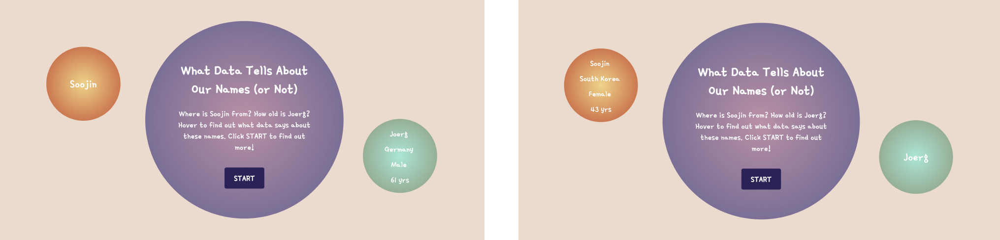

# Politics of Code Final

**Title**: Baises in Names and AI <br> 
**Author**: Soojin <br> 
**Category**: Final Project <br> 
**Date**: 20 Apr - 2 May 2022 <br> 
**Deliverable**: 1. CSS/HTML/Javascript/API Data Visualization 2. Experiment & Critical Analysis <br>

## Project Brief

Using three APIs that predict the age, the nationality, and the gender of the given name, I developed a web-based data visualization model that visualizes the data associated with names. This project explores the world demographic through the lens of data, such as the 10 most powerful people, or the Interactive Media Faculty of NYUAD. While exploring the different groups of people and their names, we critically examine the AI biases in names and its impact. <br> 

[Access Project Here](https://soojin-lee0819.github.io/PoliticsOfCodeFinal)


## Project Description

AI (Articifial Intelligence) Machines are increasingly being used to make all kinds of important decisions including who can open a bank account (or who can't), what kind of health insurance coverage, or the job screenings. AI has many positive benefits, like freeing up our time to do more chllenging tasks or automating our work. 

However, despite the repeated claim that data-driven approaches are more objective than the past human methods, AI machines don't seem to liberate us completely from the thousands of years of human bias. This is because most of the AI programs use machine learning, which are done through data training. It is true that once the machine learning is trainned, the work can be done autonomously without much human intervention. However, AI machines are essentially trainned with human data and are programmed by huamn that it is inevitable for AI systems to continue projecting existing human biases, and further exacerbate those biases at a much faster rate. 


We hear about many AI bias mishaps such as  [Google’s facial recognition algorithm labeled black people as gorillas ](https://www.forbes.com/powerful-people/list/) or more recent [mishap with Amazon’s resume recommendation system
](https://www.reuters.com/article/us-amazon-com-jobs-automation-insight/amazon-scraps-secret-ai-recruiting-tool-that-showed-bias-against-women-idUSKCN1MK08G) where the algorithm taught it self that male candidates were preferable, penalizing the resumes containing the word "women". This isn't because Amazon has intentionally programmed it's screen machine to reject women applicants. Instead, it trained its algorithm using a decade of resumes from mostly white male applicants, which its algorithm repliaceted historical hiring patterns, discriminating against women applicants. Although Amazon abaondoned the tool in 2017 before deployment, it illustrates how algorithms can reproduce existing pattenrs of inequality. 


Due to this bias encoded in world embeddings, resumes that include a black-sounding name, female-sounding name, Jewish-sounding name, or Muslim-sounding-names programs are disciminated against the others. For example when Jahanzaib Ansari was looking for work in 2016m his job search hit a dead end, despite his qualified skills and experiences. It is only after Anglicizing his name to variations including Jason, Jordan and Jacob, he saw the immediate results. Such algorithmic bias in hiring process due to algorithmic blind scpots is highly unfair and frustrating. 

On to this complex issues in data algorithm, human biases associated to names, and its impact, I developed an interactive data visualization website that allows people to type in a name to receive an information about the given name such as gender, nationality, and age. Explopring the inferred profile of each name and looking at the bigger demographic of the people through the lens data, the project invites people to critically examine the biases in machine learning AIs and its impact. 

## Part 1: Developing Data Visualization using API

This project was developed upon the data visualization game project, which I made for the class ConnectionsLab. For the original proejct, I only used two APIs (nationalize API and agify API) that give the predicted age and the nationality of the given name. Elaborating on this project,I added the third API: **genderAPI** that gives the predicted gender of the game, and created a data visualization model that shows the demographic of the world explored through the assumptions about names.


In total, I have used three APIs which are:

[agify API](https://api.agify.io/?name=michael) - An API for predicting the age of a person given their name.

[nationalize API](https://nationalize.io) - An API for predicting nationality from a name.

[gender API](https://genderize.io/?gclid=EAIaIQobChMIsfmD9dP_9QIVCcPVCh1d1gvhEAAYAiAAEgIeFfD_BwE) - An API to predict the gender of a person given their name. 


**Landing Page**


On the landing page, there are two examples - Soojin and Joerg. On hover, users can view the predicted age, nationality and the age of the given name.  
Users can scroll down, or click **START** button to type in names and start receiving information associated to these names. 

**User-custom Data Visualization**

````
function nameSubmit(){
  let name = document.querySelector("#name").value;
  ageurl = 'https://api.agify.io?name=' + name;
  nationalurl = 'https://api.nationalize.io/?name=' + name;
  genderurl = 'https://api.genderize.io?name=' + name;
  //fetchcing age url & store result 
  fetch(ageurl)
  .then(response => response.json())
  .then((ageData) => {
    resultAge = ageData.age;
    resultName = ageData.name;
    console.log(resultAge);
    console.log(resultName);
  })
````

On submit, the information for each name is fetched from the three APIs, and are displayed in specific HTML/CSS format. For example, alongside the name, the age, and the nationality are written in text format in the bubbles, and the predicted gender is visualized through the color of the bubble - yellow for female, and blue for male. The size of the bubble is proportional to the age. Above shows an example of how the data from the agify API is fetched and used.


Just like any dataset, there are For example, if I type in eraser, that is not within the data set, I added an alert system that notifies that 'this name is undefined'

## Part 2: Experiment & Critical Analysis 

Using the data visualization website created above, I visualized the demographics of certain groups including: Interactive Media Faculty at NYUAD, Computer Science Faculty at NYUAD, and the [The World's Most Powerful People](https://www.forbes.com/powerful-people/list/
) by Forbes.

### NYUAD Interactive Media Faculty


Professor Mathura's In this simplification, three different professors Michael Allison, Michael . This shows how depending of how we process the data, the outcome can be significantly different. 


**List of IM faculties in Abu Dhabi**
- Aaron Sherwood
- Michael Allison
- Michael Ang
- Joerg Blumtritt
- Heather Dewey-Hagborg
- Jonny Farrow
- Mathura Govindarajan
- Michael Shiloh


### NYUAD Computer Science Faculty


Some names were simply not available in the dataset. Since most of the data are collected from Western countries, alini


**List of CS faculties in Abu Dhabi**
- Azza Abouzied
- Moumena Chaqfeh
- Alex Delis
- Djellel Difallah
- Nizar Habash
- Lefteris Kirousis
- Azzam Mourad
- Sana Odeh
- Mai Oudah
- Christina Pöpper
- Thomas Potsch
- Talal Rahwan
- Saurabh Ray
- Riyadh Baghdadi
- Hanan Salam
- Yasir Zaki


### 10 Most Powerful People


**List of 10 Most Powerful People**
- Xi Jinping
- Vladimir Putin
- Donald Trump
- Angela Merkel
- Jeff Bezos
- Pope Francis
- Bill Gates
- Mohammed bin Salman Al Saud
- Narendra Modi
- Larry Page
